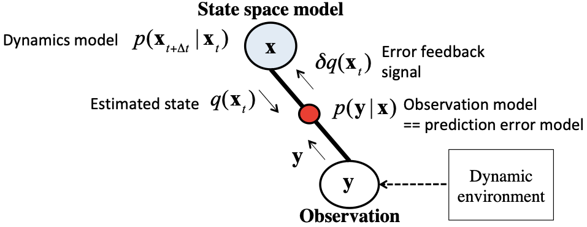
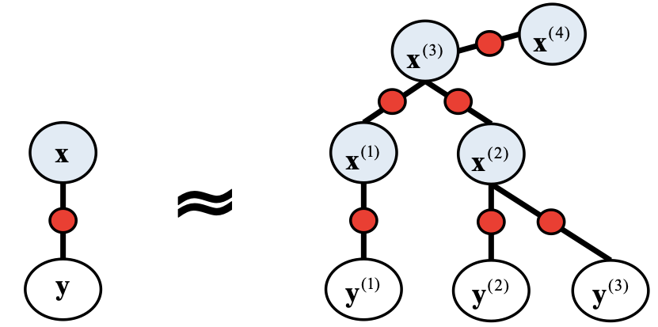
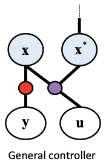
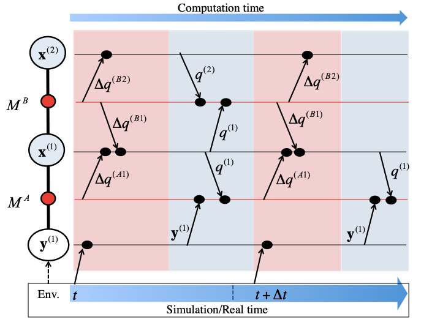

# An overview of MatcherNet

## MatcherNet as a state space model

MatcherNet is a state space model that includes Extended Kalman-filter (EKF), a non-linear extension of Kalman-filter, as a special case. The EKF works with a pair of given observation model p( y(t) | x(t) ) and dynamics model p( x(t+Delta t) | x(t) ), and it calculates the posterior of the current state q( x(t) ) = p( x(t) | y(1),...,y(t) ) in a sequential manner. In MatcherNet, the algorithm is written in a message passing among the bundles (the observation and the state space model) and the matcher (the prediction model), see the figure above.

For MatcherNet, the user may divide the observed variable  y  and the state variable  x  into multiple parts,  like  y = (y^(1), y^(2), y^(3) ),  x = ( x^(1), x^(2), x^(3), x^(4) ), respectively. Then, the state space is approximated with the hierarchically decomposed model, in which all parts of dynamics/observation model are low-dimensional, easy to learn, and re-usable models.

## MatcherNet as a model predictive controller

MatcherNet can emit control signal u in an online manner as model predictive control (MPC). A typical network structure (left pannel in the Fig. above) can implement well known controllers, such as PID, iLQR (iLQG), whereas a simpler structure (right pannel) can implement so called "active inference". In any cases, you can provide a control goal as a prior probability of the state variable, and the controller calculates the control signal that minimizes the current and future distance to the prior. 

## MatcherNet and multi-thread computing

MatcherNet efficiently works with multi-thread computing. Modular division of state-space model lower the dimensionality of each state variable, and multiple modules run in parallel in a multi-core computing environment. 
