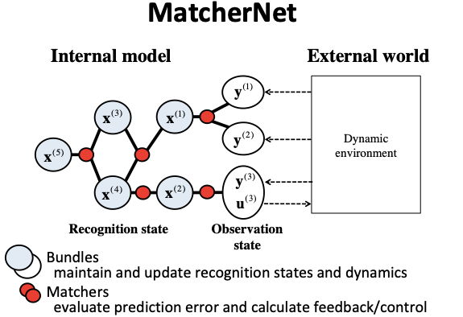

 


# What is MatcherNet?

## What is MatcherNet?
MatcherNet is a probabilistic state-space model for dynamic system identification and control. With MatcherNet, you can easily design a dynamic world model of high-dimensional / multi-modal / multi-scale states and observations for robotics, image processing, sensor networks, and their hybrid cases. MatcherNet may provide you a solution better than a large state space model, a deep neural network of end-to-end structure, etc.

 
                                                                                                  
## Acknowledgment
MatcherNet was developped with support by the New Energy and Industrial Technology Development Organization (NEDO), Japan,
and by Post-K application development for exploratory challenges from the MEXT, Japan.

# Document

See an [overview](https://github.com/shigeyukioba/matchernet/blob/master/overview.md) for knowing what is MatcherNet in a little bit more detail.

See the [matchernet documentation](https://shigeyukioba.github.io/matchernet/) for important classes and functions.

See a [developers' info.](https://github.com/shigeyukioba/matchernet/blob/master/fordevelopers.md) for knowing some additional info. for installation.

# How to install?
The alpha version has been tested and released below:
https://test.pypi.org/project/matchernet-py-001/

You can install the alpha version with the following command:
```bash
pip install -i https://test.pypi.org/simple/ matchernet-py-001
```

# How to try demos?
See demo files under the `/demos` directory.
```bash
Python3 demos/demo_ekf.py
```

See also jupyter notebooks under the `/examples` directory.

# How to set up in detail?
## For MacOSX
### Install Python 3.7.*
It is tested on 3.7.2 and 3.7.3.
3.8.* is not supported yet.
### Set up virtual environment
```bash
mkdir ~/virt_env
cd ~/virt_env
virtualenv -p Python3 mn
workon mn
```
### Install libraries
```bash
pip3 install brica2==0.5
pip3 install matplotlib==3.1.1
pip3 install numpy==1.17.3 
pip3 install autograd==1.3
pip3 install -i https://test.pypi.org/simple/ matchernet-py-001
```
### Modify PYTHONPATH
```bash
export PYTHONPATH="/path/to/dir:$PYTHONPATH"
```
You need this if you are to modify files in the matchernet original packages.

### Run a demo
```bash
Python3 demos/demo_ekf.py
```
